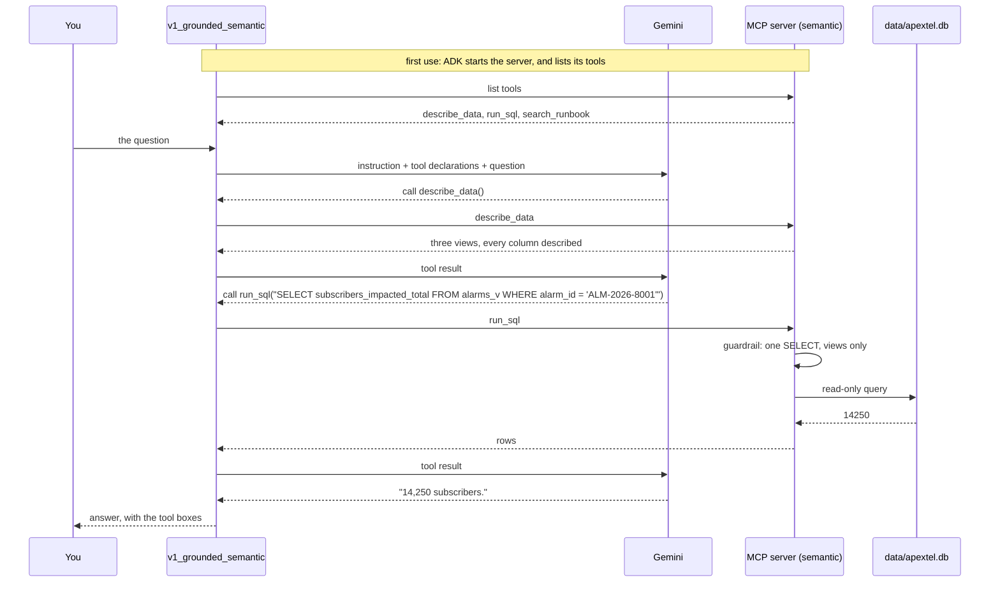

# Architecture: ApexTel NOC Triage Agent, Stage 6 (Ground)

This document describes how the agent is grounded: the MCP server that owns
ApexTel's alarm data and runbooks, the two shapes the same data can take, how
a question becomes a SQL query or a runbook search, and how the before and
after is measured.

Read [`README.md`](README.md) first if you have not run the agents yet. The
ontology is Stage 4's, the KPI framing is Stage 3's, and the guardrail idea is
Stage 2's, now applied to SQL.

---

## 1. In one paragraph

One MCP server, `mcp_server/apextel_mcp.py`, owns ApexTel's alarm records and
runbooks. It offers three tools: `describe_data` says what data exists and
what it means, `run_sql` runs one read-only query, and `search_runbook` finds
the most relevant runbook passages. The server runs in one of two modes. In
**raw** mode it exposes three back-office tables with cryptic names and
codes; in **semantic** mode it exposes three ontology-aligned views with
every column described. Three agents answer the same ten golden questions:
one with no tools, one grounded on raw mode, one grounded on semantic mode.
The difference in their scores, question by question, is the evidence that
the shape of the data matters — not just having more of it.

---

## 2. The idea in one picture

```
                    the same ten golden questions
                                 |
          +----------------------+----------------------+
          v                      v                      v
   v1_ungrounded          v1_grounded_raw        v1_grounded_semantic
   (no tools)                   |                       |
                                | MCP (stdio)           | MCP (stdio)
                                v                       v
                    apextel_mcp.py               apextel_mcp.py
                    APEXTEL_GROUNDING=raw       APEXTEL_GROUNDING=semantic
                                |                       |
               +----------------+----------+   +--------+-----------------+
               v                           v   v                          v
     3 raw tables                    5 runbooks (.md)              3 semantic views
     alm_tbl, tkt_tbl, site_tbl      (the same for both)          alarms_v, incidents_v,
               \                                                   sites_v  /
                +--------- data/apextel.db (one SQLite file) ---------+
```

Everything is identical between the two grounded agents except what the
server shows them: same model, same instruction, same tools, same runbooks,
same records.

---

## 3. Context view

```
        YOU                       YOUR MACHINE                        GOOGLE CLOUD

  +-------------+  HTTP  +------------------------------+  HTTPS  +---------------+
  |  ADK chat   |<------>|  adk web                     |<------->|  Vertex AI    |
  |  page       |        |   v1_ungrounded              |         |  Gemini       |
  +-------------+        |   v1_grounded_raw      ------+--stdio--+-> MCP server  |
                         |   v1_grounded_semantic ------+--stdio--+-> MCP server  |
  +-------------+        +------------------------------+         |  (processes   |
  | eval/       |        the MCP servers are child processes      |   on this     |
  | run_        |        of adk web, or of the eval run           |   machine)    |
  | grounding   |                                                  +---------------+
  +-------------+                   Optional, in Google Cloud:
                                    BigQuery (SQL_BACKEND=bigquery)
                                    Vertex AI RAG Engine (RAG_BACKEND=vertex)
```

**What crosses to the model.** Only what the agent asks for, as tool results:
the data description, the rows of one query (at most 50), or the best three
runbook passages. Never the whole database, and never every runbook.

**The MCP boundary.** The agents do not import the database or the runbooks.
They start the server as a separate process and talk to it over standard
input and output, exactly as they would to a server another team runs on
another machine (e.g. the RAN NOC team's own runbook server). Replacing the
transport with HTTP would not change a line of the agents.

---

## 4. Components

| Component | File | Responsibility |
|---|---|---|
| MCP server | `mcp_server/apextel_mcp.py` | Offers `describe_data`, `run_sql` and `search_runbook`. The mode comes from `APEXTEL_GROUNDING` |
| Database builder | `apextel/database.py` | Builds `data/apextel.db` from `data/apextel.json`: three raw tables and three views |
| Semantic layer | `apextel/semantic_layer.yaml` | What each view and column means, in the ontology's words |
| SQL tool | `apextel/sql.py` | The read-only guardrail, and the SQLite or BigQuery backend |
| Runbook search | `apextel/kb_search.py` | Local search over `kb/`, or Vertex AI RAG Engine |
| Runbooks | `kb/*.md` | Five documents, each owned by a NOC specialist team |
| Agent factory | `apextel/grounded.py` | Builds each agent, and connects it to the server with `McpToolset` |
| Instructions | `apextel/instructions/` | One for the grounded agents (use the tools, cite sources), one for the ungrounded agent |
| Recorder | `apextel/recorder.py` | Keeps model calls and turns, so token cost is visible |
| Eval harness | `eval/run_grounding.py`, `eval/grounding_questions.yaml` | The before and after on ten golden questions |

---

## 5. The two shapes of the data

The same 12 alarms and 11 incidents, stored the way ApexTel's real fault
management feed stores them (`Live_FM_Alarms`, `IncidentTickets_prod`), then
described the way the Stage 4 ontology says.

| Fact | Raw table and column | Semantic view and column |
|---|---|---|
| Which alarm | `alm_tbl.aid` | `alarms_v.alarm_id` |
| Severity | `alm_tbl.sev`, a bare code 1–3 | `alarms_v.severity` — Critical, Major or Minor |
| Subscriber impact | `alm_tbl.s2g, s3g, s4g, s5g, smob` — five columns, one of which (`smob`) is already the total | `alarms_v.subscribers_impacted_total` — that one column, named clearly |
| Which incident | `tkt_tbl.tid` | `incidents_v.incident_id` |
| Handling priority | `tkt_tbl.pri` | `incidents_v.priority` |
| Still open | `tkt_tbl.xdt` empty or not | `incidents_v.is_open` — yes or no |
| Site's SLA tier | join `site_tbl.prof` | `sites_v.profile` |

**Two traps are planted in the raw shape**, and both come from ApexTel's real
export format:

| Trap | What a reasonable query does | Wrong answer | Golden question |
|---|---|---|---|
| Severity stored as a bare code | Filters `sev = 'Critical'` (a string) | No rows match, because `sev` holds `1`, not the word | — a taste of it, see below |
| Subscriber impact split five ways, with no column marked as the total | Sums all five columns, assuming they're additive components | Overcounts (32,000 instead of 14,250) — or reads one generation column alone and undercounts | G1, G10 |

The views are ordinary SQL over the raw tables (`database.view_sql()`), so
they cannot disagree with them. The semantic layer adds no data; it adds
meaning.

---

## 6. How one question flows

G1 on the semantic agent: *"How many subscribers were impacted by the KLCC01
power outage, ALM-2026-8001?"*



On the raw agent the flow is the same, but `describe_data` returns only table
and column names. The model has to work out, unaided, that `smob` already
holds the total, and that summing all five columns would double-count.

---

## 7. NLP2SQL and its guardrail

The model writes the SQL. Code decides whether it runs, in `sql.check()`,
before the database is touched:

| Check | Blocks | Why |
|---|---|---|
| One statement | `SELECT ...; DROP TABLE ...` | No second statement can ride along |
| `SELECT` or `WITH` only | `DELETE`, `UPDATE`, `INSERT` | The agent answers questions; it never changes alarms or tickets |
| No data-changing keywords | `DROP`, `ALTER`, `ATTACH`, `PRAGMA` and others | A second line of defence |
| Only the mode's tables | A view in raw mode, a raw table in semantic mode | Keeps the two runs honest |
| At most 50 rows | Large result sets | One query cannot flood the context window |

The SQLite connection is also opened **read-only**, so even a query that got
past the checks could not write. A query that fails returns its error to the
model, which can read it and try again.

**BigQuery option.** With `SQL_BACKEND=bigquery` and `BQ_DATASET` set,
`run_sql` sends the same checked query to BigQuery. `sql.bigquery_setup()`
creates the dataset, loads the raw tables and creates the same views there,
using the same view SQL.

---

## 8. RAG over the runbooks

```
  kb/*.md  ->  one chunk per "##" section  ->  score each chunk against the question
                                                      |
                   the question's words, plus the ontology's synonyms
                   (failover -> reroute), rarer words counting for more
                                                      |
                                                      v
                                  the best three chunks, each with its source
```

| Choice | Why |
|---|---|
| One chunk per section | Each section is one procedure, with a heading that names it |
| Synonyms from `ontology.yaml` | Stage 4's synonyms become retrieval: "reroute" finds the failover runbook |
| Three passages, not the whole document | The context budget: only what the answer needs |
| A source on every passage | The answer can cite `bbu_power_failure.md#Rectifier Module Replacement Procedure` |
| Search is a tool | Agentic RAG: the agent decides when to search, and can search again with better words |

**Vertex AI RAG option.** With `RAG_BACKEND=vertex` and `VERTEX_RAG_CORPUS`
set, `search_runbook` queries a Vertex AI RAG Engine corpus instead.
`kb_search.vertex_setup()` creates the corpus and uploads the five runbook
files. The agents do not change; only the server's backend does.

---

## 9. The experiment, and how it is scored

`eval/run_grounding.py` runs each golden question on each agent, in a fresh
session.

| Recorded per answer | How |
|---|---|
| Correct or not | Every `expect` phrase, and at least one `any_of` phrase, appear in the answer |
| Tools used, and what each returned | From the function calls and responses in the events |
| Tokens | From the usage the model reports with every response |
| A first guess at the cause of a failure | From what the tools returned |

| Cause | The harness guesses it when | What it usually means |
|---|---|---|
| Context | No tool was called, or every query returned no rows | The answer was never in front of the model |
| Tool | The last tool call was blocked or failed | The agent did not recover from a bad query |
| Reasoning | Tools returned data, and the answer was still wrong | The right facts were there, and it misread them |

The guess is a starting point for the diagnosis, not a verdict — e.g. a raw
agent that sums all five subscriber columns and overcounts G1 looks like it
got data back (so not "context"), but the real cause is that it treated five
overlapping figures as additive parts, when only `smob` was ever the total.
Deciding that is the operator's job, recorded as an ADR.

**Why this proves the point.** The raw and semantic agents differ in one
thing only. Any question one answers and the other does not is a question
where the shape of the data decided the answer. The harness prints those as
"Fixed by the semantic layer".

---

## 10. Context management and the context budget

| Question | This kit's answer |
|---|---|
| **What** goes into the window | The description of the data once, then only the rows or passages each question needs |
| **When** | When the agent asks, through a tool call, never loaded up front |
| **From where** | From the owner, through the MCP server; never copied into the instruction |
| **How much** | At most 50 rows per query, three passages per search |

A **context budget** is a limit on what one answer may read, in tokens. The
token column in the harness output makes it measurable. This is ADR-6 in the
webinar's stage sequence: which grounding pattern to use, and why, decided
against a number, not a feeling.

---

## 11. State: what persists, and for how long

| State | Held in | Lasts |
|---|---|---|
| The alarm records | `data/apextel.json`, built into `data/apextel.db` | Until rebuilt; never written to by the agents |
| The runbooks | `kb/*.md` | Until edited |
| The MCP server | A child process of `adk web` or the eval run | Until its parent stops |
| Chat sessions | ADK session state | One session |
| Tokens and turns | `runs.jsonl` | Until deleted |
| The before and after | `baseline/grounding_v1.json` | Until the full run is repeated |

---

## 12. Known limits

| Limit | Where it shows | Where it is picked up |
|---|---|---|
| Local search matches words, not meaning | A question worded very differently from the runbook may miss it | The Vertex option, or embeddings |
| The golden set checks words in the answer | A right answer worded unusually can fail | Treat as a harness failure, not an agent failure |
| The cause of a failure is a guess | A "context"-looking failure can really be reasoning | Manual diagnosis, per question |
| The guardrail checks table names, not every SQL trick | Deliberately unusual SQL could confuse the table check | The read-only connection is the second line of defence |
| Every deployment's MCP server is local | No shared server, no authentication between agent and server yet | Stage 9: Govern |
| The cloud options are not exercised by the tests | BigQuery and Vertex AI need the project set up | Optional section of the README |

---

## 13. Configuration

| Setting | Where | Purpose |
|---|---|---|
| `GOOGLE_GENAI_USE_VERTEXAI`, `GOOGLE_CLOUD_PROJECT`, `GOOGLE_CLOUD_LOCATION`, `AGENT_MODEL` | `agents/.env`, written by `setup.sh` | The model |
| `APEXTEL_GROUNDING` | Set by each agent when it starts its server | `raw` or `semantic` |
| `SQL_BACKEND`, `BQ_DATASET` | Your terminal, optional | Run SQL on BigQuery instead of SQLite |
| `RAG_BACKEND`, `VERTEX_RAG_CORPUS`, `VERTEX_RAG_LOCATION` | Your terminal, optional | Search a Vertex AI RAG corpus instead of the local files |

The MCP server inherits the environment of the process that starts it, so
options set in a terminal reach the server only if `adk web` or the eval run
is started from that terminal.

**Packages.** The default route needs `google-adk` with its MCP support
(`pip install "google-adk[mcp]"`, which installs `mcp` 1.x — see
`requirements.txt`). The options need `google-cloud-bigquery` and
`google-cloud-aiplatform`. `setup.sh` checks the MCP support.
